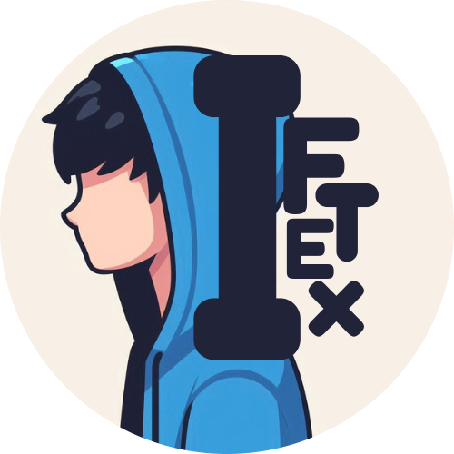

  
  <h1>Hi, I am Iftex </h1>
  
<b>Web Developer | Graphics Designer | Tech Enthusiast</b>

  

  

## 🧭 About Me
Hey there! I am Iftex or Iftekhar whatever you call me, an innovative and passionate developer working on both front-end and back-end technologies. Welcome to my profile — this is where you can know a bit about my journey, skills, current projects, work interests, worksapces, changelog of projects, new releases and other relevant things. I’m passionate about creating useful and visually appealing digital things those are not only highly functional but also user friendly. 

I was mainly focused with the front-end technologies and web developing but along the way started more things such as working with artificial intelligence, back-end projects on different languages, also have experienced versatile skills in different platfroms like Git, Github, Gitlab etc. I started my developer journey from a very young age and have gained little to larger experiences since then. I always wanted myself to take in challenges to step into bigger oppurtunities. 

Truly speaking, I am not someone so much professioanl or skilled, I learned along the way myself and still learning and improving day by day. Constantly exploring new technologies and improving my skills, aiming to build impactful projects and contribute to the developer community. I am always delighted to share thoughts or ideas and feedback from you. This is just the beginning of my journey, and I am excited to keep learning, building, and sharing along the way. Thanks for stopping by, and feel free to connect or share your thoughts!"

## 🛠️ Versatile Skills

### Front-End & Back-End Technologies

### Development Platforms

### Graphics Designing & Video Editing

## 🚀 Projects & Ongoing Work
<a href="[https://iftexworks.netlfiy.app](https://iftexworks.netlify.app/)">1. iftexworks</a> – A personal protfolio or about-me website made by myself using simple Html5, Css3, Javascript and different sources for some scripts, icons library, images and styles. The site showcases some of my works in web development and other essential things to serve as a digital portal to the visitors.  

<a href="https://marguax.netlfiy.app">2. Project Marguax</a> – Project Marguax is a powerful chatbot currently under development, with the goal of evolving into a fully functional AI system. This project is a collaborative effort carried out by our dedicated team, not just myself, including special members contributing their expertise. The link provided directs you to a sample design of the user interface or a preliminary version of the website for Marguax. The full project is still being built, and the official release date has not been set.

